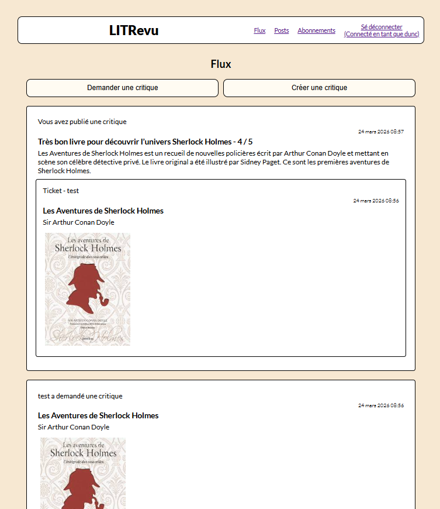

# P9 : Application web communautaire pour la critique de livres et d'articles

Projet réalisé dans le cadre du développement d'une application web pour la start-up LITRevu.

Il s'agit d'une application permettant à une communauté d'utilisateurs de publier des critiques de livres ou d’articles et de consulter ou de solliciter une critique de livres à la demande.

---

## Fonctionnalités

- Authentification : 
  - Inscription via nom d'utilisateur et mot de passe
  - Connexion via nom d'utilisateur et mot de passe
  - Déconnexion
  - L'accessibilité au site nécessite l'authentification

- Suivi d'utilisateur : 
  - Possibilité de suivre un utilisateur
  - Possibilité d'arreter de suivre un utilisateur

- Publication de critique : 
  - Création, modification et suppression de critique
  - Création d'une critique à partir d'un ticket ou non

- Demande de critique (ticket) : 
  - Création, modification et suppression de ticket
  - Création automatique d'un ticket lors de la création d'une critique seule

- Interaction avec les tickets et critiques des autres utilisateurs :
  - Visualisation des tickets et critiques des utilisateurs suivis 
  - Visualisation des critiques d'utilisateurs suivis ou non en réponse à un ticket créé par l'utilisateur connecté
  - Réponse à un ticket d'un utilisateur suivi 

  

---

## Architecture

Le projet suit une architecture MVT (Model-View-Template) et est divisé en 2 applications :
- Application d'authentification : `authentication` et application métier : `review_app`
- Model : Défini dans `models.py`, chaque classe correspond à une table de la base de données, Django ORM traduit le python en SQL.
- View : Défini dans `views.py`, reçoit une requête HTTP, interroge les modèles, prépare les données et retourne une réponse.
- Template : Défini par les fichiers `.html` dans les dossiers `templates/`, reçoit le contexte de la vue et génère le html final.


---

## Structure du projet

```
P9_LITRevu_web_app/

    README.md                               # Documentation
    .gitignore                              # Liste des dossiers et fichiers à ignorer pour le repository
    requirements.txt                        # Liste des dépendances
    
    LITRevu/                                # Répertoire principal projet Django
        authentication/                     # Application d'authentification - inscription et connexion 
        LITRevu/                            # Configuration globale du projet (settings, urls)
        media/                              # Fichiers uploadés par les utilisateurs (images)
        review_app/                         # Application métier - tickets, critiques et abonnements (MVT)
        static/                             # Fichiers statiques communs (CSS)
        templates/                          # Gabarits HTML communs 
        db.sqlite3                          # Base de données 
        manage.py                           # Fichier de gestion de commandes Django
        

```

---

## Technologies utilisées

- Django
- Pillow
- CSS3
- flake-8

---

## Installation 

### Prérequis :

- Python 3.10 ou plus récent
- Connexion internet

### Cloner le repository : 

```bash
git clone https://github.com/duncan-g-hub/P9_LITRevu_web_app.git
cd P9_LITRevu_web_app
```

---

### Créer et activer l'environnement virtuel : 

```bash
cd P9_LITRevu_web_app
python -m venv env 
# Windows
source env/Scripts/activate
# Mac/Linux
source env/bin/activate
```
---

### Gestion de la SecretKey

Copier `.env.example` en `.env` et renseigner la SECRET_KEY

---

### Installation des dépendances

```bash
cd P9_LITRevu_web_app
pip install -r requirements.txt
```

---

### Appliquer les migrations

```bash
cd P9_LITRevu_web_app
cd LITRevu
python manage.py migrate
```

---

### Créer un compte administrateur (optionnel)

```bash
cd P9_LITRevu_web_app
cd LITRevu
python manage.py createsuperuser
```
Suivre les instructions dans le terminal pour définir un nom d'utilisateur et un mot de passe.

---

### Compte de test

Un compte de test est disponible pour explorer l'application sans créer de compte :
- Nom d'utilisateur : test
- Mot de passe : mdpTest01*


---

## Exécuter l'application

Lancement serveur local : 
```bash
cd P9_LITRevu_web_app
cd LITRevu
python manage.py runserver
```
Depuis un navigateur, accéder à l'URL : http://127.0.0.1:8000/

---

## Compatibilité

Le site a été testé sur les dernières versions stables des navigateurs les plus utilisés :
- Google Chrome (v145)
- Mozilla Firefox (v147)
- Microsoft Edge (v144)

Le site respecte les standards HTML5 et CSS3 validés par le validateur W3C, ce qui garantit une compatibilité avec les navigateurs modernes.

---

## Aperçu 



---

## Contact

Pour toute question :  
Duncan GAURAT - duncan.dev@outlook.fr

            
